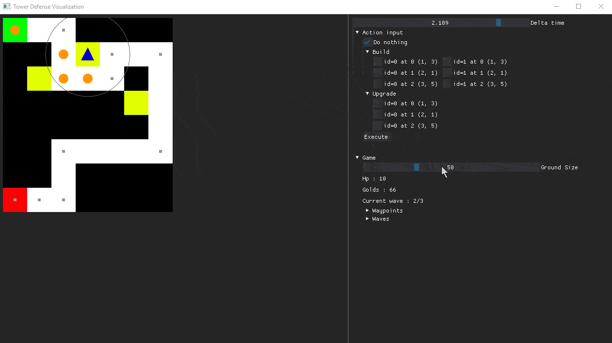

# QAdaptative

>AI adjustment difficulty project.
>Currently in development.

## Implementation

### Game

We've used DearPyGui to make simple Tower Defense game with a debug panel.

</src>

### Decision trees

</src>

## Final implementation (future)

Program will require SFML, ImGUI, SFML-ImGUI and libtorch with CUDA 12.1
</src>